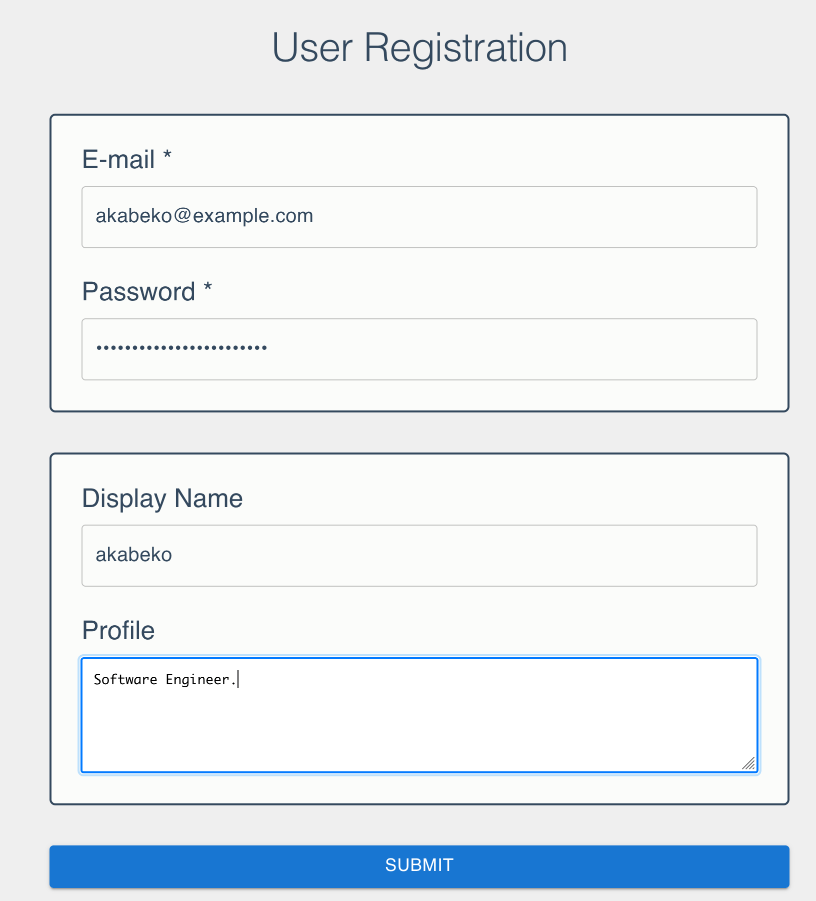
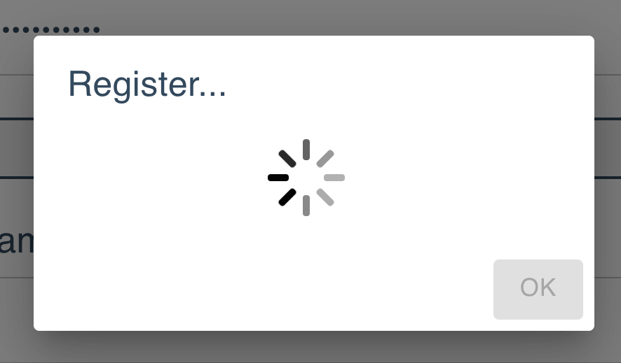
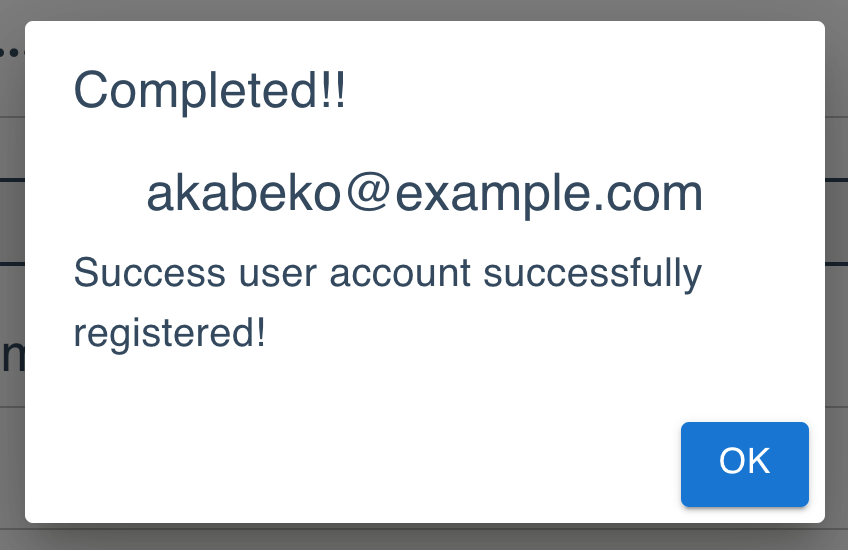

# examples-rhf-zod

[](https://nodejs.org/)

Example for a validation with [React Hook Form](https://github.com/react-hook-form/react-hook-form) and [Zod](https://github.com/colinhacks/zod).

## Getting Started

Run the following after the `git clone`.

```bash
npm i
# or
yarn
```

First, run the development server:

```bash
npm run dev
# or
yarn dev
```

Open [http://localhost:3000](http://localhost:3000) with your browser to see the result.

## Screenshot

| Form                    | Submitting                    | Submitted                    |
| ----------------------- | ----------------------------- | ---------------------------- |
|  |  |  |

## Tech Stack

- [Next.js](https://nextjs.org/)
- [React](https://reactjs.org/)
- [TypeScript](https://www.typescriptlang.org/)
- [MUI](https://mui.com/)
- [Container/Presentational Pattern](https://www.patterns.dev/posts/presentational-container-pattern/)

## License

- [MIT](LICENSE)
